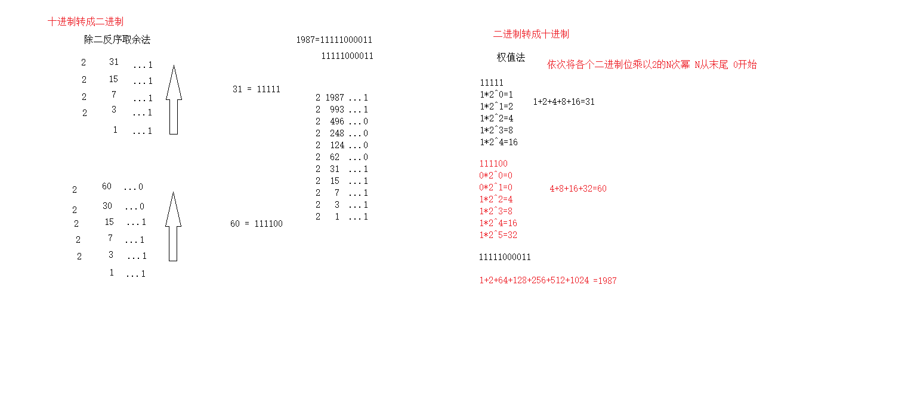

### 常用进制的表示及转换方法

#### 1. C语言中表示进制的方法

进制 | 说明
-- | --
十进制 | 以正常数字"1-9"开头，如123
八进制 | 以数字"0"开头，如0123
十六进制 | 以"0x"开头，如0x123

>* *注：二进制 (C语言不能直接书写二进制数)*
  
  **进制输出占位符"%o",%d","%x"分别表示输出一个八进制数，十进制数，十六进制数。**

----

#### 2. 进制转换方法

   十进制转化为其他(n)进制采用除n反向取余法。
   其他(n)进制转化为十进制采用权值法。(从低位到高位)
   十进制的小数转换成二进制：小数部分和2相乘，取整数，不足1取0，每次相乘都是小数部分，顺序看取整后的数就是转化后的结果。
  
   二进制转十六进制:一般把每四个二进制数放一起(从低位开始)逐个转化为十六进制。
   二进制转八进制:一般把每三个二进制数放一起(从低位开始)逐个转化为八进制。
   

----

#### 3. 计算机中数值存储方式
   
   原码:该数的原始二进制码
        最高位做为符号位，0表示正,为1表示负
其它数值部分就是数值本身绝对值的二进制数
负数的原码是在其绝对值的基础上，最高位变为1
   反码:作为求补码的中间过渡
        对于正数，反码与原码相同
        对于负数，符号位不变，其它部分按位取反
 原码和反码运算不方便，所以有补码。

   补码:在计算机系统中，数值一律用补码来存储。
	对于正数，原码、反码、补码相同
	对于负数，其补码为它的反码加1或者其绝对值的二进制按位取反再加1
        
        由负数的补码求原码:
        补码符号位不动，其他位求反，最后整个数加1，得到原码
   补码的意义:统一了零的编码
	      将符号位和其它位统一处理
	      将减法运算转变为加法运算
 两个用补码表示的数相加时，如果最高位(符号位)有进位，则进位被舍弃

#### 4. 关键字sizeof

   关键字sizeof功能是计算一个数据类型的大小，单位为字节
  "size_t"类型在32位操作系统下是unsigned int，是一个无符号的整型

```
        int a;
	int b = sizeof(a);
	printf("b = %d\n", b);
```

```
	size_t c = sizeof(a);
	printf("c = %u\n", c);//用无符号数的方式输出c的值
```


   
   


